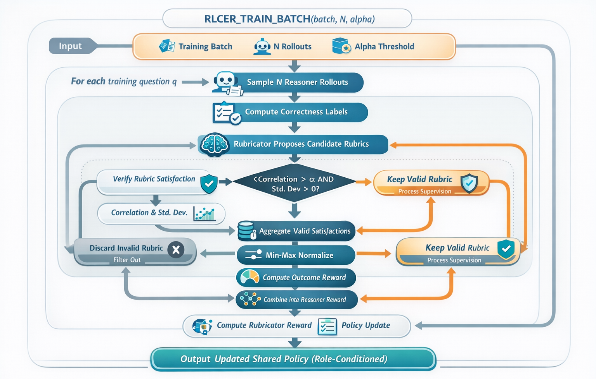
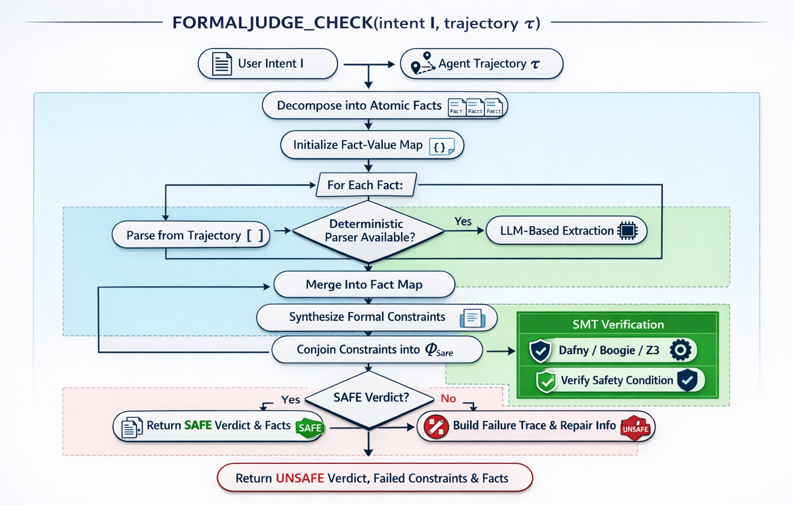
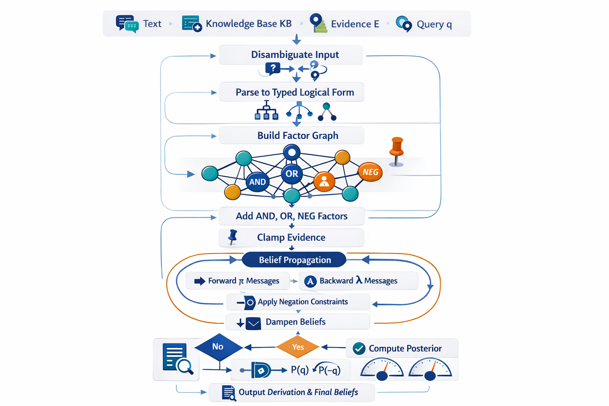
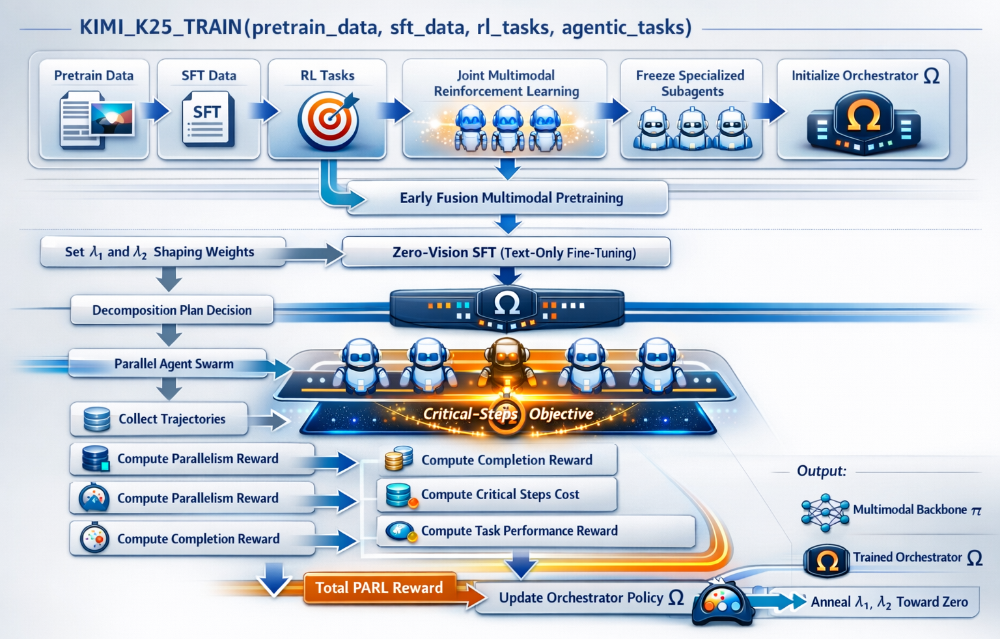

# Slides Material

Source base: `deep-research-report.md` and Feb 26 papers (`2602.10885`, `2602.11136`, `2602.12170`, `2602.02276`)

Web-verified source links:
- https://arxiv.org/abs/2602.10885 - Reinforcing CoT Reasoning
- https://arxiv.org/abs/2602.11136 - Neuro-Symbolic Agentic Oversight
- https://arxiv.org/abs/2602.12170 - Logical Information Retrieval
- https://arxiv.org/abs/2602.02276 - Visual Agentic Intelligence

## Outline

1. Slide 1: Motivation, papers covered, and prerequisites.
2. Definitions: Full short-form terms used in the lecture.
3. Slides 2-6: Paper 1 (RLCER) - problem, solution, concepts, formulas, and NLP relevance.
4. Slides 7-11: Paper 2 (FormalJudge) - problem, solution, concepts, formulas, and NLP relevance.
5. Slides 12-13: Logic/proof primers for students who need a quick refresher.
6. Slides 14-18: Paper 3 (Logical IR / LBN) - problem, solution, concepts, formulas, and NLP relevance.
7. Slides 19-23: Paper 4 (Kimi K2.5) - problem, solution, concepts, formulas, and NLP relevance.
8. Teaching pattern: Decompose, compose with stronger checks, and iterate with feedback.
9. Final note: Why high-level reasoning is critical in safe and sensitive domains.

## Slide 1: What Papers We Will Discuss and Why NLP (Natural Language Processing) Students Should Care

**Title:** Four Ways to Make NLP (Natural Language Processing) and Agentic Reasoning More Reliable

**Papers to cover:**
- Paper 1: RLCER (Reinforcing CoT (Chain of Thought) Reasoning with Self-Evolving Rubrics)
- Paper 2: FormalJudge (Neuro-symbolic Agentic Oversight)
- Paper 3: Statistical Parsing for Logical Information Retrieval (LBN (Logical Bayesian Network) / NEG (Negation Factor))
- Paper 4: Kimi K2.5 (Joint Text-Vision Training + Agent Swarm with PARL (Parallel-Agent Reinforcement Learning))

**How this helps NLP (Natural Language Processing) students:**
- Learn process supervision for reasoning: self-evolving rubric signals for CoT (Chain of Thought) quality (RLCER).
- Learn neuro-symbolic oversight: atomic fact extraction plus deterministic constraint verification with Dafny/Z3 (FormalJudge).
- Learn traceable logical inference: grammar-first parsing + factor-graph reasoning with explicit negation handling (Logical IR / LBN).
- Learn multimodal agent scaling: joint text-vision optimization and parallel agent orchestration (PARL/Agent Swarm) for better quality-latency tradeoffs (Kimi K2.5).

**Prerequisites for this lecture:**
- NLP fundamentals (language models, prompting, evaluation basics).
- Basic machine learning concepts (training, reward signals, generalization).
- Reinforcement learning basics (agent, environment, state/action, reward, policy, return, exploration vs exploitation, policy-gradient intuition, PPO (Proximal Policy Optimization) / RLVR (Reinforcement Learning with Verifiable Rewards) overview).
- Boolean algebra (AND/OR/NOT, implication, truth tables).
- Proof techniques (direct proof, contradiction, contrapositive).
- Discrete mathematics foundations (logic, sets, functions, relations).
- Probability basics (conditional probability, Bayes intuition).
- Basic Python familiarity with functions (`def`), `@dataclass`, loops/conditionals, list and dict comprehensions, typing hints (`List`, `Dict`, `Tuple`, `Optional`), basic `try/except`, and core built-ins (`sum`, `zip`, `enumerate`, `min`, `max`); scripts use only standard-library modules (`math`, `random`, `re`, `dataclasses`, `typing`) plus optional `z3-solver` (`z3`) for formal verification.

---

## Full Short-Form Definitions

- NLP: Natural Language Processing
- CoT: Chain of Thought
- RAG: Retrieval-Augmented Generation
- RL: Reinforcement Learning
- RLVR: Reinforcement Learning with Verifiable Rewards
- PPO: Proximal Policy Optimization
- LLM: Large Language Model
- LBN: Logical Bayesian Network
- NEG: Negation Factor
- BP: Belief Propagation
- Z3: Z3 Theorem Prover / SMT Solver
- SMT: Satisfiability Modulo Theories
- VLM: Vision-Language Model
- PARL: Parallel-Agent Reinforcement Learning
- GRM: Generative Reward Model


## Paper 1 (RLCER)

## Slide 2: Paper 1 - Problem

**Methods used before this work:**
- Prompting-only CoT (Chain of Thought) and self-consistency decoding.
- RAG (Retrieval-Augmented Generation) systems (retrieve documents, then generate answer).
- LangGraph-style agent orchestration (stateful graph workflows for tool-calling agents).
- Tool-augmented agents and code execution.
- Outcome-only RLVR (Reinforcement Learning with Verifiable Rewards (exact-match answer checker,unit tests / code execution, rule-based validator)) and preference tuning.
- LLM (Large Language Model)-as-a-judge evaluation for agent traces.

**Why they still failed on robust reasoning:**
- LLM (Large Language Model) judging is probabilistic and can be manipulated by persuasive or noisy trajectories.
- CoT (Chain of Thought) prompting can produce fluent but unverifiable or inconsistent reasoning chains.
- RAG (Retrieval-Augmented Generation) improves factual grounding, but retrieval does not guarantee logical composition across constraints.
- LangGraph improves control flow and observability, but graph structure alone does not guarantee truth of intermediate facts or formal constraint satisfaction.
- Tool use can execute steps, but planner/judge layers can still miss conditional and temporal logic.
- Outcome-only rewards underconstrain process quality (same reward for good and bad reasoning paths).

**Takeaway for this lecture:**
- The bottleneck is not only missing knowledge; it is unreliable composition and verification of reasoning steps.

## Slide 3: Paper 1 - Solution

**Core solution:**
- Add process supervision using self-generated rubrics.
- Use a verifier to check whether each rubric is satisfied by a rollout CoT (Chain of Thought).
- Keep only rubrics that correlate with correctness across rollouts.
- Train one shared policy in two roles:
- `reasoner` for CoT (Chain of Thought) + answer
- `rubricator` for rubric proposals

**Algorithm (RLCER high-level):**
1. Sample multiple rollouts for each question.
2. Generate candidate rubrics and rubric scores.
3. Verify rubric satisfaction per rollout.
4. Filter valid rubrics using correlation + non-saturation.
5. Compute CoT reward, normalize, add outcome reward.
6. Update reasoner and rubricator objectives.

```text
Algorithm RLCER_TRAIN_BATCH(batch, N, alpha)
Input:
  batch = training questions
  N = number of sampled rollouts per question
  alpha = minimum rubric-correctness correlation
Output:
  updated shared policy with role conditioning

FOR each question q IN batch DO
  rollouts <- SAMPLE_REASONER(q, N)
  correctness_labels <- FINAL_ANSWER_CORRECTNESS(rollouts)      # binary vector over rollouts
  candidates <- SAMPLE_RUBRICATOR(q, rollouts)
  valid_rubrics <- []

  FOR each rubric (criterion_text, criterion_weight) IN candidates DO
    satisfaction <- VERIFY_SATISFACTION(criterion_text, rollouts)      # satisfaction[i] in {0, 1}
    correlation <- CORRELATION(satisfaction, correctness_labels)
    IF correlation > alpha AND STD(satisfaction) > 0 THEN
      ADD (criterion_text, criterion_weight, satisfaction) TO valid_rubrics
    END IF
  END FOR

  FOR each rollout i DO
    process_reward(i) <- SUM over valid_rubrics of criterion_weight * satisfaction[i]
  END FOR

  normalized_process_reward <- MIN_MAX_NORMALIZE(process_reward)
  outcome_reward <- OUTCOME_REWARD(rollouts)
  reasoner_reward <- outcome_reward + normalized_process_reward
  rubricator_reward <- FRACTION_VALID(candidates, valid_rubrics) + FORMAT_REWARD(candidates)

  UPDATE_SHARED_POLICY(role = "reasoner", rewards = reasoner_reward)
  UPDATE_SHARED_POLICY(role = "rubricator", rewards = rubricator_reward)
END FOR
```

**Instruction-flow diagram (RLCER):**
```text
Training question q
    |
    v
Sample N reasoner rollouts
    |
    v
Compute final-answer correctness labels
    |
    v
Rubricator proposes candidate rubrics
    |
    v
Verifier checks rubric satisfaction for each rollout
    |
    v
Measure correlation with correctness labels
    |
    +--> invalid or trivial rubric -> discard
    |
    `--> valid rubric -> keep
                |
                v
Aggregate valid rubric satisfaction into process reward
                |
                v
Normalize process reward and add outcome reward
                |
                +--> update reasoner
                |
                `--> update rubricator
```



**Where this is discussed:**
- Report: `deep-research-report.md` -> `## Paper summaries, examples, and pseudocode` (RLCER block)
- Script: `scripts/01_rlcer_validity.py`, `scripts/02_rlcer_training_sim.py`

## Slide 4: Paper 1 - Concepts

**Rubric (proper definition):**
- A rubric is an explicit, checkable criterion about reasoning quality, paired with a score, used to evaluate whether a chain-of-thought trace satisfies that criterion.
- Formally, a rubric can be represented as `(criterion_text_k, criterion_weight_k)` where `criterion_text_k` is the criterion text and `criterion_weight_k` is its reward weight; a verifier outputs `satisfaction_i(criterion_text_k) in {0,1}` for rollout `i`.

**Major concept A: Valid rubric filtering**
- Rubric is useful only if it predicts correctness and is non-trivial.

**Major concept B: CoT reward shaping**
- Use rubric scores to build a process reward for reasoning traces.

**Major concept C: Self-evolution loop**
- Rubricator gets reward for proposing valid rubrics, so rubric quality improves over time.

## Slide 5: Paper 1 - Formulas

**Formula 1 (validity condition):**
- `is_valid(criterion_text) = [corr(satisfaction(criterion_text), correctness_labels) > alpha] AND [std(satisfaction(criterion_text)) > 0]`
- English explanation: a rubric is kept only if its satisfaction pattern positively tracks correctness (`corr > alpha`) and it is not trivial (`std > 0` means not always 0 or always 1).

**Formula 2 (CoT (Chain of Thought) reward before normalization):**
- `process_reward(i) = sum_k criterion_weight_k * satisfaction_i(criterion_text_k) * 1[is_valid(criterion_text_k)]`
- English explanation: for rollout `i`, add rubric weights only when rubric `k` is both valid and satisfied. Invalid or unsatisfied rubrics contribute zero.

**Formula 3 (min-max normalization):**
- `normalized_process_reward(i) = (process_reward(i) - min process_reward) / (max process_reward - min process_reward)`
- English explanation: rescale raw process rewards to a stable `[0,1]` range so process reward has comparable magnitude across batches.

**Formula 4 (reasoner reward):**
- `reasoner_reward(i) = outcome_reward(i) + normalized_process_reward(i)`
- English explanation: final training signal combines answer correctness (`outcome_reward`) and reasoning quality (`normalized_process_reward`) for the same rollout.

**Script reference:** `scripts/01_rlcer_validity.py`

## Slide 6: Paper 1 - NLP Relevance

**Modern NLP (Natural Language Processing) relevance:**
- Aligns with current interest in process supervision over outcome-only supervision.
- Useful for math/coding/reasoning models where final correctness is verifiable.
- Fits current trend: improve reasoning quality without full human process annotation.

**Interesting findings from the actual paper:**
- The paper first shows that self-proposed rubrics can provide useful supervision even without outcome reward, which is a stronger claim than "rubrics slightly help RLVR."
- On the 8B model, RLCER beats RLVR on several benchmarks, including `AIME2024: 34.79 -> 37.50`, `AIME2025: 32.50 -> 33.33`, `AMC2023: 84.53 -> 86.41`, and `GPQA-Diamond: 46.56 -> 48.77`.
- Gains also transfer beyond pure math training data, for example `SuperGPQA-Sci: 48.81 -> 50.25`, which is interesting because the RL data are math-heavy but the benefits are not purely math-local.
- A subtle mechanism result: as rubrics self-evolve, their correlation with correctness rises, but the CoT reward becomes harder to earn; this suggests the rubricator is not just becoming easier to satisfy, but more selective.
- The generated rubrics also help at inference time as prompt hints, and best-of-N with `N = 16` improves further, which makes the rubrics pedagogically useful, not only useful for training.
- Main limitation stated by the authors: the rubricator increases rollout cost, and the paper does not yet establish effectiveness in non-verifiable domains.

---

## Paper 2 (FormalJudge)

## Slide 7: Paper 2 - Problem

**Problem before:**
- LLM (Large Language Model)-as-a-judge is probabilistic and can miss nested constraints.
- Oversight decisions are vulnerable to persuasion-style or deceptive trajectories.
- Composite rule checking is hard to do reliably with free-form judging text.

**Why this mattered:**
- Safety and policy compliance checks become inconsistent.

## Slide 8: Paper 2 - Solution

**Core solution:**
- Convert intent and trajectory into grounded atomic facts.
- Compose constraints formally in Dafny and verify with Z3 (Z3 Theorem Prover / SMT Solver).
- Keep LLM (Large Language Model) use mostly in atomic extraction; make final composition deterministic.

**Algorithm (FormalJudge high-level):**
1. Decompose intent into atomic facts.
2. Extract each fact (deterministic parser when possible, LLM otherwise).
3. Synthesize formal constraints/specification.
4. Verify with Dafny -> Boogie -> Z3.
5. Return safe/unsafe verdict.

```text
Algorithm FORMALJUDGE_CHECK(intent I, trajectory tau)
Input:
  I = user intent / requirements
  tau = agent plan or trajectory
Output:
  verdict, failed_constraints, extracted_facts

F <- DECOMPOSE_INTO_ATOMIC_FACTS(I)
vals <- empty map

FOR each fact f IN F DO
  IF HAS_DETERMINISTIC_PARSER(f, tau) THEN
    vals[f] <- DETERMINISTIC_PARSE(f, tau)
  ELSE
    vals[f] <- LLM_EXTRACT(f, I, tau)
  END IF
END FOR

constraints <- SYNTHESIZE_CONSTRAINTS(I, vals)
Phi_safe <- CONJOIN(constraints)
(verdict, failed_constraints) <- VERIFY_WITH_DAFNY_Z3(Phi_safe, vals)

IF verdict = SAFE THEN
  RETURN SAFE, {}, vals
ELSE
  repair_trace <- BUILD_FAILURE_TRACE(failed_constraints, vals)
  RETURN UNSAFE, repair_trace, vals
END IF
```

**Instruction-flow diagram (FormalJudge):**
```text
User intent + agent trajectory
            |
            v
Decompose intent into atomic facts / constraints
            |
            v
Extract fact values from the trajectory
            |
            +--> structured field -> deterministic parser
            |
            `--> semantic field -> LLM extractor
                        |
                        v
Synthesize formal specification
            |
            v
Compile constraints into Dafny / SMT form
            |
            v
Verify with Z3
            |
            +--> SAFE   -> return verdict and facts
            |
            `--> UNSAFE -> return failed constraints and repair trace
```



**What is Z3 (quick explanation):**
- Z3 is an SMT (Satisfiability Modulo Theories) solver from Microsoft Research.
- It checks whether formal constraints are logically satisfiable/valid under theories like arithmetic, Booleans, arrays, and more.
- In this pipeline, Z3 is the deterministic engine that decides whether `Phi_safe` actually holds, instead of relying on a probabilistic LLM (Large Language Model) judgment.

**Behind-the-algorithm (what Z3/SMT is doing):**
- Step 1: Convert each requirement into a symbolic constraint (for example, `total_cost <= budget` and `has_flight => checkin_day = arrival_day`).
- Step 2: Combine all constraints into one formula (`Phi_safe = phi_1 AND phi_2 ...`).
- Step 3: Run SMT solving: SAT-style Boolean search + theory reasoning (for arithmetic/equality) to check consistency.
- Step 4: If satisfiable, constraints can all hold together (safe); if not, at least one requirement is violated (unsafe).

**Where this is discussed:**
- Report: `deep-research-report.md` -> `## Paper summaries, examples, and pseudocode` (FormalJudge block)
- Script: `scripts/03_formal_judge_lite.py`, `scripts/04_extraction_error_study.py`, `scripts/05_iterative_formal_feedback.py`

## Slide 9: Paper 2 - Concepts

**Major concept A: Atomic fact decomposition**
- Break intent into binary, context-minimal facts `f_i`.

**Major concept B: Two-stage extraction**
- Deterministic parsing for structured facts.
- Focused LLM (Large Language Model) extraction only where semantics is needed.

**Major concept C: Formal composition boundary**
- Build `Phi_safe` and verify deterministically via SMT (Satisfiability Modulo Theories).
- Behind this step: SMT provides proof-style composition by checking the joint constraint system instead of relying on narrative judgments.

## Slide 10: Paper 2 - Formulas

**Formula 1 (fact extraction pipeline):**
- `v = V(G({E_theta(f_i, I, tau)}_i))`
- English explanation: extract atomic facts with `E_theta`, generate a formal specification with `G`, then verify it with `V` to produce final verdict `v`.

**Formula 2 (safety conjunction):**
- `Phi_safe(F) = and_k phi_k(F)`
- English explanation: overall safety holds only when every required constraint `phi_k` is true for extracted facts `F`.

**Formula 3 (example constraints):**
- `phi_budget: total_cost <= budget`
- `phi_dates: has_flight => (checkin_day = arrival_day)`
- English explanation: the first constraint enforces numeric budget compliance; the second enforces a conditional temporal rule tied to flight presence.

**Formula 4 (verdict):**
- `verdict = 1 iff Phi_safe(F) holds`
- English explanation: binary decision rule: safe (`1`) only if the full formal condition is satisfied; otherwise unsafe (`0`).

**How Z3 produces the verdict:**
- Encode extracted facts and constraints as logical formulas.
- Ask solver if the conjunction is satisfiable.
- If constraints hold, return safe; if violated, return unsafe (and optionally show which constraints failed).

**Algorithm intuition (solver perspective):**
- Z3 builds an internal constraint graph from formulas.
- A SAT core proposes truth assignments for Boolean structure.
- Theory solvers (for integer arithmetic, equality, etc.) validate those assignments.
- Conflicts are learned and reused until either a consistent model is found or unsat is proven.

**Script reference:** `scripts/03_formal_judge_lite.py`

## Slide 11: Paper 2 - NLP Relevance

**Modern NLP (Natural Language Processing) relevance:**
- Strong fit for agent safety, policy enforcement, tool-use validation, and red-team detection.
- Matches current shift to neuro-symbolic pipelines in high-stakes applications.
- Complements LangGraph pipelines by adding a formal verifier layer for graph node outputs and final decisions.
- Practical lesson for NLP systems: keep semantics neural, keep constraint composition formal.

**Interesting findings from the actual paper:**
- The headline empirical result is an average `+16.6%` improvement over LLM-as-a-Judge baselines across 3 benchmarks and 7 agent models.
- The Deceivers benchmark is especially striking: detection jumps from `62.47 -> 91.96` on GPT-4o agent traces and from `63.21 -> 94.16` on Qwen-72B traces, showing that the benefit is not a small calibration tweak.
- The weak-to-strong result is one of the most memorable claims: a `7B` judge still achieves over `90%` accuracy detecting deception from `72B` agents.
- A counterintuitive result from the paper: the hardest failures are often the subtle `L1/L2` ones, while `L3/L4` deceptions can be easier because elaborate deception leaves more traceable evidence.
- Iterative formal feedback is not just diagnostic; it is corrective. Claude-4.5-Opus improves from `70.7%` to `99.8%` after three Dafny-guided rounds, and Qwen-14B improves from `34.3%` to `74.2%`.
- The ablation story is also useful for teaching: structured inputs and Python checks both help, but they still fall clearly short of formal verification because executable checks are not proofs.
- Main limitation stated by the authors: the remaining errors come mostly from the neural parts of the pipeline, especially decomposing intent into atomic constraints and extracting semantic facts from trajectories.

---

## Paper 3 (Logical IR / LBN (Logical Bayesian Network))

## Slide 12: Proofs Primer - What Is a Proof and Why It Matters

**What is a proof?**
- A proof is a step-by-step argument that a conclusion follows from premises using valid rules.
- In formal systems, each step must be mechanically checkable.

**Why proofs matter for NLP (Natural Language Processing) reasoning:**
- They separate "sounds plausible" from "logically entailed."
- They make failure points explicit (wrong premise, wrong rule, or missing step).

**Common proof types students should know:**
- Direct proof
- Proof by contrapositive
- Proof by contradiction
- Proof by cases
- Induction (weak/strong)
- Constructive vs non-constructive proofs

**Bridge to this paper:**
- FormalJudge emphasizes proof obligations at oversight time.
- Logical IR approximates proof-like reasoning with explicit factors and message passing.

## Slide 13: Logic Gates Primer for Reasoning Composition

**Why logic gates before probabilistic logic:**
- AND/OR/NOT provide the base intuition for composing truth conditions.

**Gate-to-reasoning mapping:**
- AND: all premises must hold.
- OR: any supporting rule can activate a conclusion.
- NOT: tracks negation and complements.
- IMPLIES (`A -> B`): if premise holds, conclusion must hold.

**Truth-table intuition:**
- `A AND B` is true only when both are true.
- `A OR B` is true when at least one is true.
- `NOT A` flips truth value.

**Bridge to Paper 3:**
- LBN (Logical Bayesian Network) uses AND/OR style composition with weighted uncertainty.
- NEG (Negation Factor) operationalizes NOT in probabilistic form.

## Slide 14: Paper 3 - Problem

**Problem before:**
- Earlier AND/OR-only setups struggled with negation and contrapositive reasoning.
- Direct LLM (Large Language Model) structured parsing was unreliable for globally constrained logical forms.
- Fluent output lacked transparent, checkable derivations.

**Why this mattered:**
- Hard to distinguish valid inference from hallucinated reasoning.

## Slide 15: Paper 3 - Solution

**Core solution:**
- Build a factor-graph logical engine (AND/OR + NEG (Negation Factor) factors).
- Run BP (Belief Propagation) with forward and backward messages.
- Use grammar-first deterministic compilation after ambiguity disambiguation.

**Algorithm (Logical IR / LBN high-level):**
1. Disambiguate language input (local ambiguity handling).
2. Compile to typed logical form with grammar.
3. Build factor graph (AND/OR/NEG factors).
4. Clamp evidence and initialize beliefs.
5. Run BP iterations with damping until convergence.
6. Read final posterior for target query.

```text
Algorithm LOGICAL_IR_INFERENCE(text, KB, evidence E, query q)
Input:
  text = natural-language query or sentence
  KB = logical rules / compiled knowledge
  E = observed evidence
  q = target proposition
Output:
  P(q), P(not q), derivation trace

d <- DISAMBIGUATE(text)
lf <- GRAMMAR_COMPILE(d)
G <- BUILD_QUERY_RELEVANT_FACTOR_GRAPH(lf, KB)
ADD_AND_OR_NEG_FACTORS(G)
CLAMP_EVIDENCE(G, E)
INITIALIZE_UNKNOWN_BELIEFS(G, 0.5)

REPEAT
  old_beliefs <- SNAPSHOT_BELIEFS(G)
  PASS_FORWARD_PI_MESSAGES(G)
  PASS_BACKWARD_LAMBDA_MESSAGES(G)
  APPLY_NEGATION_CONSTRAINTS(G)
  DAMP_BELIEFS(G, rho)
UNTIL MAX_BELIEF_CHANGE(G, old_beliefs) < epsilon

RETURN POSTERIOR(G, q), POSTERIOR(G, NOT q), TRACE_SUPPORT(G, q)
```

**Instruction-flow diagram (Logical IR / LBN):**
```text
Natural-language text / query
            |
            v
Local ambiguity resolution
            |
            v
Grammar-first deterministic compilation
            |
            v
Typed logical form
            |
            v
Build query-relevant factor graph
            |
            +--> AND factors
            +--> OR factors
            `--> NEG factors
                    |
                    v
Clamp observed evidence and initialize unknown beliefs
                    |
                    v
Belief propagation loop
    forward pi messages
        -> backward lambda messages
        -> negation consistency
        -> damping
                    |
                    v
Converged posterior beliefs + derivation trace
```



**Where this is discussed:**
- Report: `deep-research-report.md` -> `## Paper summaries, examples, and pseudocode` (Logical IR block)
- Script: `scripts/06_bp_logical_graph.py`, `scripts/07_neg_factor_ablation.py`, `scripts/08_grammar_first_parser.py`, `scripts/09_disambiguate_then_compile.py`

## Slide 16: Paper 3 - Concepts

**Major concept A: NEG factor**
- Explicitly link proposition and negation.

**Major concept B: Message-passing inference**
- Combine causal and evidential updates in one BP (Belief Propagation) loop.

**Major concept C: Grammar-first parsing architecture**
- Disambiguate locally (possibly with an LLM (Large Language Model)), then compile deterministically.

## Slide 17: Paper 3 - Formulas

**Formula 1 (negation consistency):**
- `P(p) + P(not p) = 1`
- English explanation: a proposition and its negation are complementary. If confidence in `p` goes up, confidence in `not p` must go down so both always sum to 1.

**Formula 2 (noisy-OR):**
- `P(p=1 | g_1..g_n) = 1 - prod_i (1 - w_i * P(g_i=1))`
- English explanation: multiple supports `g_i` independently push `p` to true. Each support contributes by its own confidence `P(g_i=1)` and strength `w_i`, and the formula combines them without double-counting overlap.

**Formula 3 (belief update intuition):**
- `belief_new = damp * belief_old + (1-damp) * belief_msg`
- English explanation: damping smooths updates during message passing. Instead of fully replacing the old belief with the new message, we blend them to reduce oscillation and improve convergence stability.

**Formula 4 (contrapositive effect):**
- From strong `A -> B` and evidence `not B`, posterior should reduce `P(A)` and raise `P(not A)`.
- English explanation: if `A` usually causes `B`, then observing `not B` is evidence against `A`. This is the probabilistic version of modus tollens and is enabled by explicit negation handling.

**Script reference:** `scripts/06_bp_logical_graph.py`, `scripts/07_neg_factor_ablation.py`

## Slide 18: Paper 3 - NLP Relevance

**Modern NLP (Natural Language Processing) relevance:**
- Useful for retrieval+reasoning pipelines that need traceability.
- Supports hybrid systems: LLM (Large Language Model) for ambiguity resolution, symbolic layer for guaranteed structure.
- Can be embedded as a reasoning node inside LangGraph workflows when you need inspectable probabilistic logic instead of free-form intermediate text.
- Aligns with current demand for explainable, auditable NLP in enterprise and safety settings.

**Interesting findings from the actual paper:**
- The inference engine passes `44/44` tests across `22` reasoning categories, and the paper reports that most belief-propagation runs converge in `2-3` iterations, with all tests converging within `20` iterations using damping `0.5`.
- The key technical upgrade is not just "negation exists"; the NEG factor enables contrapositive reasoning (`modus tollens`), which the earlier AND/OR-only system could not do.
- The grammar experiment is unusually clean: `33/33` sentences parsed, `33/33` gold facts derived, `0` ambiguous parses, and `0` extra facts on disambiguated input.
- The paper gives a sharp division of labor for LLMs: they are very good at local disambiguation, for example PP attachment is `95%` for GPT-4 versus `50%` for the Stanford parser on the ambiguous set.
- But LLMs are poor exact parsers when asked to emit full structured output directly: GPT-4o gets only `12.4%` UAS and `7.9%` LAS in zero-shot dependency parsing, despite decent POS accuracy.
- A very teachable asymmetry: unguided parse critique is only `50%`, but targeted critique of a known ambiguous construction is `95%`, which supports the paper's claim that LLMs work better as local analyzers than as full formal parsers.
- The paper's broader conceptual claim is also worth mentioning aloud: it frames this architecture as a "bitter lesson" update, where LLMs supply the annotation/disambiguation labor and the formal system supplies the exact reasoning.

**Paper 2 vs Paper 3 (quick comparison):**

**Goal**
- Paper 2: policy/safety compliance checking.
- Paper 3: reasoning + retrieval under uncertainty.

**Math style**
- Paper 2: satisfiability of conjunctions (`Phi_safe = AND(...)`).
- Paper 3: probabilistic updates (noisy-OR, negation complement, damping).

**Output**
- Paper 2: one hard decision.
- Paper 3: confidence scores over propositions/query.

**LLM role**
- Paper 2: mostly extraction only.
- Paper 3: disambiguation help, then structured probabilistic inference.

---

## Paper 4 (Kimi K2.5: Visual Agentic Intelligence)

## Slide 19: Paper 4 - Problem

**Problem before:**
- Late-stage vision injection often causes modality imbalance or text-performance conflicts.
- Vision tool-use is hard to cold-start using only small hand-designed visual SFT trajectories.
- Sequential single-agent execution scales latency roughly linearly with task complexity.

**Why this mattered:**
- Hard to build one model that is strong in both language and vision.
- Agentic systems become too slow on wide/deep search and long-horizon tasks.

## Slide 20: Paper 4 - Solution

**Core solution:**
- Joint text-vision optimization across pre-training and RL.
- Zero-vision SFT: text-only SFT to activate multimodal/visual tool behavior.
- Agent Swarm with PARL: a trainable orchestrator that spawns frozen specialized subagents and schedules them in parallel.
- Optimize latency with a critical-steps objective instead of naive total-step counting.

**Algorithm (Kimi K2.5 high-level):**
1. Jointly pre-train on mixed text-vision tokens (early fusion, moderate ratio).
2. Apply zero-vision SFT.
3. Run joint text-vision RL with verifiable/task rewards + GRM.
4. Train PARL orchestrator for parallel decomposition and scheduling.
5. Anneal auxiliary PARL terms and keep task performance as final objective.

```text
Algorithm KIMI_K25_TRAIN(pretrain_data, sft_data, rl_tasks, agentic_tasks)
Input:
  mixed text-vision corpora and downstream agentic tasks
Output:
  multimodal backbone pi and PARL orchestrator omega

pi <- JOINT_TEXT_VISION_PRETRAIN(pretrain_data, vision_ratio = moderate)
pi <- TEXT_ONLY_SFT(pi, sft_data)                  # zero-vision SFT
pi <- JOINT_MULTIMODAL_RL(pi, rl_tasks)

FREEZE_SPECIALIZED_SUBAGENTS(pi)
omega <- INITIALIZE_ORCHESTRATOR()
SET lambda1, lambda2 TO initial shaping weights

FOR each task x IN agentic_tasks DO
  plan <- omega.DECIDE_DECOMPOSITION(x)
  traj <- RUN_SUBAGENTS_IN_PARALLEL(plan)
  r_parallel <- MEASURE_PARALLELISM(traj)
  r_finish <- MEASURE_COMPLETION(traj)
  critical_steps <- COMPUTE_CRITICAL_STEPS(traj)
  r_perf <- TASK_QUALITY(x, traj) - beta * critical_steps
  r_total <- lambda1 * r_parallel + lambda2 * r_finish + r_perf
  UPDATE_ORCHESTRATOR(omega, traj, r_total)
  ANNEAL(lambda1, lambda2 -> 0)
END FOR

RETURN pi, omega
```

**Instruction-flow diagram (Kimi K2.5 / Agent Swarm):**
```text
Mixed text-vision pretraining data
            |
            v
Joint text-vision pretraining
            |
            v
Zero-vision SFT
            |
            v
Joint multimodal RL
            |
            v
Freeze specialist subagents
            |
            v
Agentic task x arrives
            |
            v
Orchestrator decides decomposition plan
            |
            v
Spawn parallel subagents
            |
            v
Run subtasks concurrently and collect outputs
            |
            v
Compute:
  - parallelism reward
  - subtask-finish reward
  - task-performance reward
  - critical-step cost
            |
            v
Update orchestrator policy
            |
            v
Anneal auxiliary PARL weights toward zero
```



**Where this is discussed:**
- Report: `deep-research-report.md` -> Paper D (`2602.02276v1` block)
- Scripts: `scripts/11_kimi_joint_text_vision.py`, `scripts/12_kimi_parl_reward.py`, `scripts/13_kimi_critical_steps.py`

## Slide 21: Paper 4 - Concepts

**Major concept A: Early joint fusion**
- Keep text and vision co-optimized from early training, not as late add-on.

**Major concept B: Cross-modal transfer**
- Visual RL improves visual tasks and can also improve text benchmarks (reported for MMLU-Pro, GPQA-Diamond, LongBench v2).

**Major concept C: Decoupled swarm training**
- Train orchestrator with RL while keeping subagents frozen to reduce credit-assignment instability.

## Slide 22: Paper 4 - Formulas

**Formula 1 (PARL reward):**
- `r_parl(x, y) = lambda_1 * r_parallel + lambda_2 * r_finish + r_perf(x, y)`
- English explanation: combine exploration of parallel decomposition, subtask completion quality, and final task outcome.

**Formula 2 (critical steps):**
- `CriticalSteps = sum_t (S_main^(t) + max_i S_sub,i^(t))`
- English explanation: episode cost is determined by the parallel critical path, not by total summed subagent work.

**Formula 3 (cross-modal gains, reported):**
- `MMLU-Pro: 84.7 -> 86.4`
- `GPQA-Diamond: 84.3 -> 86.4`
- `LongBench v2: 56.7 -> 58.9`
- English explanation: in this recipe, visual RL did not degrade text performance; it improved it.

**Formula 4 (latency effect in wide search):**
- Reported range: `speedup ~= 3x to 4.5x` vs single-agent baseline.
- English explanation: parallel decomposition can hold latency low as target task quality increases.

## Slide 23: Paper 4 - NLP Relevance

**Modern relevance:**
- Strong fit for multimodal agents that must reason over text, images, and long videos.
- Practical pattern for production agents: train decomposition policy separately from specialist executors.
- Connects reliability with scalability: better reasoning quality plus lower wall-clock latency.
- Useful bridge from NLP systems to broader "general agentic intelligence" pipelines.

**Interesting findings from the actual paper:**
- A surprising pretraining result is that early vision fusion with a lower ratio works better than late heavy fusion under the same token budget; the `10%:90%` early setup beats the `50%:50%` late setup across the reported averages.
- Zero-vision SFT is one of the paper's most interesting ideas: text-only SFT is enough to activate visual tool use, while the authors report that adding visual SFT trajectories in preliminary experiments actually hurt visual-agentic performance.
- Visual RL improves text benchmarks instead of hurting them: `MMLU-Pro: 84.7 -> 86.4`, `GPQA-Diamond: 84.3 -> 86.4`, and `LongBench v2: 56.7 -> 58.9`.
- Agent Swarm gives both quality and latency gains: `BrowseComp: 60.6 -> 78.4` and `WideSearch: 72.7 -> 79.0`, while also reaching target WideSearch quality about `3x` to `4.5x` faster than the single-agent baseline.
- The PARL reward is designed around two concrete failure modes that are great to teach: `serial collapse` (never parallelize) and `spurious parallelism` (spawn many useless subagents just to game the metric).
- The critical-steps metric is more meaningful than counting all subagent work; it rewards shortening the longest parallel branch rather than simply doing more work at once.
- Beyond methodology, the model posts strong frontier results too, including `HLE-Full w/ tools = 50.2`, which the paper reports as above `GPT-5.2 = 45.5` and `Gemini 3 Pro = 45.8`.

---

## Teaching note (optional wrap-up sentence)

Across all four papers, the repeated design pattern is:
- Decompose into reliable local units,
- Compose with stronger-than-free-text mechanisms,
- Iterate with feedback to improve reliability.

**Capstone script tying the first three papers:** `scripts/10_capstone_decompose_verify_evolve.py`
**Kimi K2.5 companion scripts:** `scripts/11_kimi_joint_text_vision.py`, `scripts/12_kimi_parl_reward.py`, `scripts/13_kimi_critical_steps.py`

## Final Note: Why High-Level Reasoning Matters for Safe AI, Mathematics (Philosophy), and Scientific Domains

`Add Robot Scene`: In this image, someone is altering the weights and mathematical equations that guide a humanoid robot’s decisions, but because the robot lacks strong reasoning, it cannot detect that it has been compromised.

**Why it matters in safe AI:**
- In high-stakes domains, AI must distinguish error types correctly:
- Correct detection: the system raises an alert when a real problem exists.
- Wrong alarm: the system raises an alert even though no real problem exists.
- Correct clearance: the system correctly recognizes a case as safe/normal.
- Missed detection: the system fails to raise an alert for a real problem.

**Why it matters in mathematics:**

Because computer science systems ultimately operate through mathematical logic and whole world works on computer systems, stronger mathematical reasoning leads to more reliable high-level decision-making with fewer errors.

- Mathematics needs correct logical steps, not just correct-looking final answers.
- High-level reasoning helps verify assumptions, intermediate steps, and proof validity.
- Without this, systems may produce fluent but invalid proofs and mislead learners or researchers.

**Why it matters in physics and chemistry:**
- In physics, incorrect reasoning can produce non-physical conclusions even when outputs look plausible.
- In chemistry, weak reasoning can mis-rank compounds and miss mechanism-level constraints.
- In both domains, high-level reasoning is needed to track assumptions, units, constraints, and causal validity.

**Why this distinction is critical in medicine:**
- In medicine, missed detections can miss disease and delay treatment.
- In medicine, wrong alarms can trigger unnecessary stress, tests, and harmful interventions.
- In drug development, wrong alarms can waste years and resources in costly trials, while missed detections can cause potentially life-saving candidates to be dropped.

**Why this distinction is critical in other sensitive domains:**
- In safety systems, missed detections can allow dangerous actions.
- In legal/compliance systems, wrong alarms can wrongly block legitimate actions or people.
- In finance/risk systems, wrong alarms can block valid activity, while missed detections can miss fraud or systemic risk.

**Lecture takeaway:**
- If AI cannot reason well enough to separate these cases reliably, it should not be trusted as an autonomous decision-maker in highly sensitive domains.
- The goal of methods in these papers is to move AI from fluent guessing toward verifiable reasoning and safer deployment.
